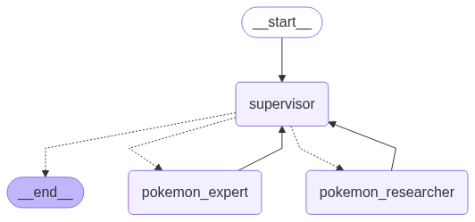

# PokeSys

PokeSys is an AI System specialized in answering general and specific questions about Pokemon.

PokeSys was developed using a hierarchical architecture where we have the role of the coordinating agent
being the interface between the user and the other agents.

## System Architecture



The System consist in 3 agents.

### 1. Coordinator Agent (Supervisor)

* Receives and responds to user requests

* Delegates specific tasks to specialized agents and use your answers to improve your decision making

* Has a dedicated tool to access general information about a pokemon

* Can answer general questions

* Formats your response in a structured way

### 2. Research Agent

* Receive a list of Pokemon to search for

* Fixes possible name errors

* Uses a tool to search for a list of information about a list of pokemons

* The tool response brings attributes about pokemons

* The tool response is directed as the agent's final response

### 3. Expert Agent

* Receive data from 2 pokemons

* Uses a tool to extract insights about who would win the fight, considering the attributes and types of the Pokémon

## Stack

The AI System was developed using FastAPI, Uvicorn, Langchain, Langgraph, Pydantic and Docker.

The System was tested with low cost models such as `openai/gpt-4.1-mini`.

## Usage

### Clone

Clone the repository

```bash
git clone https://github.com/vilsonrodrigues/pokesys.git
cd pokesys
```

### Configure Envs

Create a .env file

```bash
touch .env
```

Edit this file with project configs

```bash
OPENAI_API_KEY=sk-proj-...
POKESYS_MODEL_ID=gpt-4.1-mini
POKESYS_PROVIDER=openai
```

### Build the Docker image

```bash
make build
```

### Run the Docker image

```bash
make run
```

## API

### Docs Endpoint

The OpenAPI documentation is available in `0.0.0.0/docs`

### Chat Endpoint

Answers general and specific questions about Pokemon

#### Example 1

Query:

```bash
curl -X 'POST' \
  'http://0.0.0.0:8000/chat' \
  -H 'accept: application/json' \
  -H 'Content-Type: application/json' \
  -d '{
  "question": "tell me something interesting about Mew"
}'
```

Expected output:

```
{
    "reasoning":null,
    "answer":"Mew is a mythical Pokémon known for being extremely rare, with many experts considering it almost a mirage. It has short, fine, delicate hair that can be seen under a microscope. Interestingly, it is said to appear only to people who are pure of heart and have a strong desire to see it."
}
```

#### Example 2

Query:

```bash
curl -X 'POST' \
  'http://0.0.0.0:8000/chat' \
  -H 'accept: application/json' \
  -H 'Content-Type: application/json' \
  -d '{
  "question": "What are the base stats of Charizard?"
}'
```

Expected output:

```
{
  "name": "Charizard",
  "base_stats": {
    "hp": 78,
    "attack": 84,
    "defense": 78,
    "special_attack": 109,
    "special_defense": 85,
    "speed": 100
  }
}
```

#### Example 3

Query:

```bash
curl -X 'POST' \
  'http://0.0.0.0:8000/chat' \
  -H 'accept: application/json' \
  -H 'Content-Type: application/json' \
  -d '{
  "question": "Who would win in a battle, Pikachu or Bulbasaur?"
}'
```

Expected output:

```
{
  "reasoning": "Pikachu is an Electric-type Pokémon with high speed and decent attack, which gives it an advantage in striking first. However, Bulbasaur is a Grass/Poison-type with higher overall defenses and special attack stats. Electric moves do normal damage to Bulbasaur. Bulbasaur's higher bulk and ability to use special attacks effectively could help it endure Pikachu's hits and retaliate strongly.",
  "answer": "While Pikachu's speed is an advantage, Bulbasaur's higher defenses and special attack stats likely give it the upper hand, making Bulbasaur the probable winner."
}
```

#### Example 4

Query:

```bash
curl -X 'POST' \
  'http://0.0.0.0:8000/chat' \
  -H 'accept: application/json' \
  -H 'Content-Type: application/json' \
  -d '{
  "question": "What is the capital of Brazil?"
}'
```

Expected output:

```
{
  "reasoning": null,
  "answer": "The capital of Brazil is Brasília."
}
```
### Battle Endpoint

#### Example 1

Query:

```bash
curl -X 'GET' \
  'http://0.0.0.0:8000/battle?pokemon1=lucario&pokemon2=Aegislash' \
  -H 'accept: application/json'
```

Expected output:

```
{
    "reasoning":"Lucario's Fighting/Steel typing and high offensive stats give it a strong advantage against Aegislash, whose Steel/Ghost typing makes it vulnerable to Lucario's moves. Lucario's attacks deal increased damage to Aegislash, while Aegislash's attacks are less effective on Lucario. Despite Aegislash's high defense and form-switching abilities, Lucario's balanced offensive and speed stats likely allow it to overcome Aegislash in battle.",
    "winner":"Lucario"
}
```

## Development

To contribute, first install uv

```bash
curl -LsSf https://astral.sh/uv/install.sh | sh
```

Sync project

```bash
uv sync
```

Run Tests

```bash
uv run --all-groups pytest
```

## Project Structure

```
├── assets
│   └── graph.png
├── Dockerfile
├── hello.py
├── LICENSE
├── Makefile
├── pokesys
│   ├── agents
│   │   ├── expert.py
│   │   ├── generation
│   │   │   ├── __init__.py
│   │   │   └── schemas.py
│   │   ├── __init__.py
│   │   ├── prompts
│   │   │   ├── expert.py
│   │   │   ├── __init__.py
│   │   │   ├── researcher.py
│   │   │   └── supervisor.py
│   │   ├── researcher.py
│   │   └── tools
│   │       ├── expert.py
│   │       ├── __init__.py
│   │       ├── researcher.py
│   │       └── supervisor.py
│   ├── config
│   │   ├── app.py
│   │   ├── __init__.py
│   │   ├── llm.py
│   ├── executor.py
│   ├── graph
│   │   ├── builder.py
│   │   ├── __init__.py
│   ├── llm.py
│   ├── logger.py
│   ├── server
│   │   ├── __init__.py
│   │   ├── main.py
│   │   ├── routers
│   │   │   ├── battle.py
│   │   │   ├── chat.py
│   │   │   ├── health.py
│   │   │   ├── __init__.py
│   │   │   └── root.py
│   │   └── schemas
│   │       ├── battle.py
│   │       ├── chat.py
│   │       ├── __init__.py
│   └── workflow.py
├── pyproject.toml
├── README.md
├── requirements.txt
└── uv.lock
```